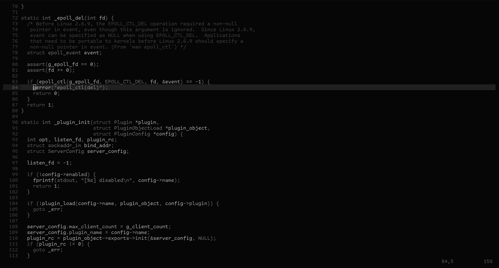
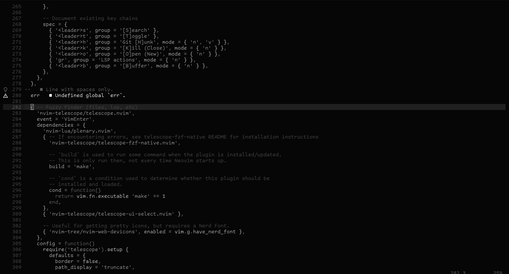
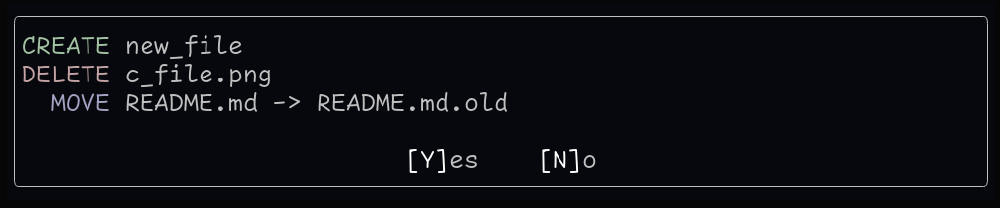

Dark theme, mostly black/gray/white, with very rare occurences of basic RGB
colors.

Errors are bright white to grab your attention.  Regular code is a tuned down
white.  Language constructs, operators, line numbers, etc are grayish to keep
them out of your focus.

I do change this often as I feel like it.  Feel free to copy / fork to use as a
starting point.

# Screenshots

## C File

## Lua File with errors

## Sample usage of RGB colors in Oil.nvim dialog

